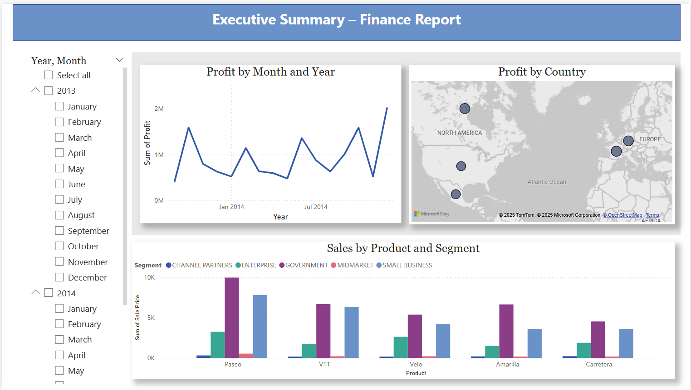

# 📊 Executive Summary – Finance Report  
**Financial Performance Analysis Using Power BI**  

## 🔍 Overview  
This Power BI dashboard provides key insights into **financial and sales performance**, including:  
✅ **The most profitable month and year**  
✅ **Top-performing markets by country/region**  
✅ **Best products and segments for investment**  

### 📷 **Dashboard Preview**  
  

## 📂 Project Contents  
🔹 **Power BI File (.pbix)** – Full interactive report  
🔹 **README.md** – Project documentation  

## ⚙️ Tools & Technologies Used  
- **Power BI Desktop** for data visualization and reporting  
- **DAX (Data Analysis Expressions)** for custom calculations  
- **Interactive charts and slicers** for better insights  

## 📈 Dashboard Features  
- **📉 Line Chart:** Displays profit trends by **month and year**  
- **🌍 Map Visualization:** Shows profit distribution by **country/region**  
- **📊 Bar Chart:** Analyzes **sales by product and segment**  
- **📅 Slicer:** Allows filtering by **year and month**  

## 🚀 How to Use  
1. **Download the File:** Get the **Power BI (.pbix)** file from the repository.  
2. **Open in Power BI Desktop:** Explore the interactive dashboard and apply filters.  

 
